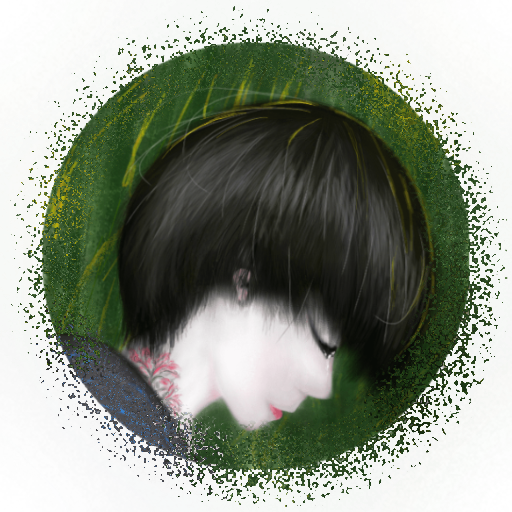

### Selayang Pandang

 [**Mughni Mind**][1] adalah wadah buat menumpahkan gayung demi gayung pikiran yang telah menggenang lama di kepala saya. Gampangnya "Mughni Mind" mencuat semata karena nafsu pribadi untuk menumpahkan segala pikiran yang menyesak kepala. Sebab itu, konten yang termuat dalam "Mughni Mind" tidak direncanakan untuk mengangkat sebuah topik tertentu, karena konsep macam itu telah berulang kali berhasil membatasi hingga bahkan memapat aliran tumpahnya kubangan pikiran saya.

[1]: https://mughnimind.github.io

### Struktur Halaman

Lebih jauh lagi, pembebasan topik/pembahasan konten dalam "Mughni Mind" juga Saya maksudkan untuk semakin menekankan bahwa "Mughni Mind" merupakan muara dari beragam pikiran yang terjebak di kepala Saya. Meski demikian_—jika memang nantinya bakal bermunculan banyak topik disini_, demi kepentingan kerapihan dan kesederhanaan situs "Mughni Mind", beragam topik tersebut dirangkum dalam enam kategori, yaitu:

[**Dokumen**][2] mencakup hampir semua _postingan_ yang berkaitan dengan bahasa, kata beserta komplotannya; [**Gambar**][3] memuat banyak konten yang _berekstensi_ .jpg, .png, .tiff, .psd, .cdr, atau apapun itu yang berbentuk gambar; [**Musik**][4] mencoba berurusan dengan yang dikonsumsi telinga; [**Video**][5] tempatnya ulasan berkenaan dengan film, serial tv, atau semacam gambar bergerak lain, dan; [**Gawai**][6] mengusik masalah perangkat, piranti, atau apalah itu namanya.

Fitur pencarian dan halaman [**Tagar**][7] juga tersedia buat semakin mempermudah pengunjung blog dalam menjelajahi blog ini.

[2]: ../Kategori/Dokumen/
[3]: ../Kategori/Gambar/
[4]: ../Kategori/Musik/
[5]: ../Kategori/Video/
[6]: ../Kategori/Gawai/
[7]: /Tagar

### Proses Penerbitan "Mughni Mind"

>Dari sekian paragraf di halaman ini, di bagian inilah yang paling ingin Saya pamerkan, keseluruhan proses pembuatan "Mughni Mind" yang 99,95% digarap hanya dengan menggunakan _**Smartphone**_.

Berkat seonggok [_Smartphone_][_Smartphone_] bersistem operasi [Android][Android] yang menjerumuskan Saya ke berbagai ranah yang berserakan di [Internet][Internet], dan akibat berbagai informasi yang Saya comot dari sana-sini, hingga akhirnya menitah jemari Saya untuk mem_-publish_ blog dengan segala embel-embelnya tanpa sedikitpun berurusan dengan layar komputer dkk. Mulai dari registrasi, kostumisasi, posting, dan penambahan [pengaya][pengaya] "Mughni Mind" seluruhnya dieksekusi di _Smartphone_.

[_Smartphone_]: https://id.m.wikipedia.org/wiki/Ponsel_cerdas
[Android]: https://id.m.wikipedia.org/wiki/Android_(sistem_operasi)
[Internet]: https://id.m.wikipedia.org/wiki/Internet
[pengaya]: https://en.m.wiktionary.org/wiki/add-on

Keseluruhan detail proses pembuatan blog "Mughni Mind" untuk saat ini Saya pikir tidak mungkin untuk dijabarkan di halaman ini, semoga dalam waktu dekat dapat Saya rampungkan dan segera terlampir di sini.

>Singkatnya, **membuat blog** berikut beragam embel-embelnya dapat diselesaikan hanya melalui _handheld_.

Berikut ini hanya Saya tuliskan pondasinya saja, yaitu bagian-bagian utama yang dibutuhkan untuk membuat situs tanpa harus menyentuh laptop dkk. Sekaligus juga sebagai kredit terhadap jasa berbagai pihak yang sangat berperan atas ter_publish_-nya "Mughni Mind".

Perangkat Keras:

[**Smartphone**][Smartphone], menggunakan [sistem operasi][Operasi] Android.

[**Secangkir Kopi**][Kopi], alat bantu pembunuh jemu.

[Smartphone]: https://id.m.wikipedia.org/wiki/Ponsel_cerdas
[Operasi]: http://id.wikipedia.org/wiki/Sistem_operasi
[Kopi]: https://id.m.wikipedia.org/wiki/Kopi

***

Perangkat Lunak:

[**Termux**][Termux], Terminal emulator Android.

[**MiXplorer**][MiXplorer], penjelajah berkas.

[**QuickEdit**][QuickEdit], penyunting teks.

[**Chrome Browser**][Chrome], peramban Android.

[Termux]: https://termux.com
[MiXplorer]: https://forum.xda-developers.com/showthread.php?t=1523691
[QuickEdit]: https://forum.xda-developers.com/android/apps-games/app-quickedit-text-editor-t2899385
[Chrome]: https://play.google.com/store/apps/details?id=com.android.chrome

***

Perkakas:

[**Github**][Github], penyedia halaman.

[**Hexo**][Hexo], sebagai generator halaman statis.

[**Tema Material**][Material], karya [Viosey][Viosey].

[Github]: https://github.com
[Hexo]: https://hexo.io
[Material]: https://material.viosey.com/en/
[Viosey]: https://viosey.com

***

Kompetensi:

Semua orang yang tertarik dengan:

[**Plain texts**][Plain], alias teks biasa.

[**Markdown**][Md], pemroses teks polos ke bentuk _html_.

[**bash**][Bash], sedikit pengetahuan mengenai _Bourne again shell_.

[**Html**][Html], bahasa yang digunakan peramban untuk menampilkan struktur halaman sebuah situs.

[**Css**][Css], pelengkap si-_html_ agar terlihat menarik.

[Plain]: https://id.m.wikipedia.org/wiki/Teks_biasa
[Md]: https://en.m.wikipedia.org/wiki/Markdown
[Bash]: https://id.m.wikipedia.org/wiki/Bourne-Again_shell
[Html]: https://id.m.wikipedia.org/wiki/HTML
[Css]: https://id.m.wikipedia.org/wiki/Cascading_Style_Sheets

***

### Kehausan Kritik & Saran

Berkat pengalaman penulisan Saya yang _céték_, senang sekali rasanya jika pengunjung blog macam ini merelakan sedikit waktunya untuk berkomentar mengenai "Mughni Mind". Singkatnya, Saya butuh kritik sekaligus saran serupa banyak makalah yang bertebaran di kelas-kelas terik siang hari paling membosankan. Caranya dapat dilakukan melalui kolom komentar di kaki halaman atau langsung melalui surat elektronik ([email][email]) yang tertera di bar navigasi, atau lebih lengkapnya silahkan kunjungi halaman [Profil][Profil].

[email]: mailto:ac.mughni@gmail.com
[Profil]: /Profil

Selanjutnya, karena konten "Mughni Mind" sebagian besar belum tersaring dengan baik dan benar, tiap kali menkonsumsi konten "Mughni Mind" ada baiknya untuk kembali menyaring, memasak, dan mengolah pelbagai informasi yang _—mungkin saja_ disematkan. Jadi singkatnya, "Mughni Mind" lebih disarankan untuk dikonsumsi oleh manusia dengan batas pemikiran yang elastis.

### Penutup

Demikianlah [Halaman Tentang][id] yang terlalu panjang dan bertele-tele ini, _—semoga seseorang berkenan untuk membaca halaman ini hingga akhir paragraf_.

Terimakasih.

acemughnie

[id]: /Tentang
